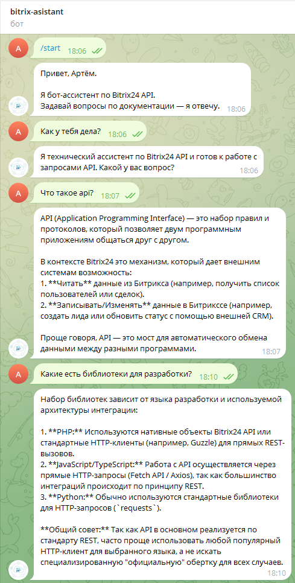

# Bitrix24 AI Assistant Bot

Telegram-бот для ответов на вопросы по API документации Bitrix24 с использованием локальной LLM (Ollama) и RAG-подхода.

Бот парсит документацию Bitrix24, создает базу знаний и использует локальную языковую модель для генерации релевантных ответов без отправки данных на сервер.

---

## Требования

- Python 3.10+
- Ollama (локальный запуск LLM)
- Telegram Bot Token
- Linux / macOS / Windows (WSL2)
- 8+ GB RAM

---

## Установка

### 1. Клонирование

```bash
git clone https://github.com/AirWolf5230/bitrix24-ai-assistant.git
cd bitrix24-ai-assistant
```

### 2. Виртуальное окружение

```bash
python3 -m venv venv
source venv/bin/activate
```

### 3. Зависимости

```bash
pip install --upgrade pip
pip install -r requirements.txt
```

### 4. Установка Ollama

#### Windows (WSL2):
```bash
curl -fsSL https://ollama.com/install.sh | sh
```

---

## Конфигурация

### 1. Telegram Bot Token

1. Откройте Telegram и найдите бота **@BotFather**
2. Отправьте `/newbot`
3. Следуйте инструкциям и скопируйте токен

### 2. Файл .env

Создайте файл `.env` в корневой папке:

```bash
touch .env
```

Добавьте следующие переменные:

```env
# TELEGRAM
TELEGRAM_BOT_TOKEN=ВАШ_ТОКЕН_ОТ_BOTFATHER

# OLLAMA
OLLAMA_URL=http://localhost:11434/api/generate
OLLAMA_MODEL=gemma4:latest

# DATABASE 
DB_HOST=localhost
DB_PORT=5432
DB_NAME=bitrix_assistant
DB_USER=postgres
DB_PASSWORD=ваш_пароль
```

### 3. Запуск Ollama

Откройте новый терминал и запустите сервер:

```bash
ollama serve
```

По умолчанию доступен по `http://localhost:11434`

### 4. Загрузка модели

Откройте еще один терминал:

```bash
# Основная модель (рекомендуется)
ollama pull gemma4:latest
```

Первая загрузка займет 5-15 минут.

### 5. WSL2 (только для Windows)

Если вы используете WSL2, обновите .env:

```env
OLLAMA_URL=http://172.17.32.1:11434/api/generate
```

Или узнайте IP Windows машины:
```bash
cat /etc/resolv.conf | grep nameserver
```

---
# Подготовка базы знаний

Перед первым запуском бота необходимо собрать локальную базу знаний из документации Bitrix24.

Перейдите в корневую папку проекта:

```bash
cd ~/projects/bitrix-asistant
```

Активируйте виртуальное окружение:

```bash
source venv/bin/activate
```

Запустите сбор базы знаний:

```bash
python -m app.knowledge.build_db
```

После завершения работы будет создан индекс в каталоге:

```text
app/knowledge/storage/
```

Этот индекс используется системой RAG для поиска релевантных фрагментов документации.

# Проверка базы знаний

Убедитесь, что индекс был создан:

```bash
ls app/knowledge/storage
```

Ожидаемый результат:

```text
index.pkl
```

Если файл отсутствует, повторно выполните:

```bash
python -m app.knowledge.build_db
```
## Запуск

### Способ 1 (рекомендуется)

```bash
./run.sh
```

### Способ 2

```bash
source venv/bin/activate
python3 -m app.main
```

---

## Использование

1. Найдите вашего бота в Telegram
2. Отправьте `/start`
3. Задавайте вопросы по API Bitrix24:
   - "Как получить контакты?"
   - "Какие методы есть в CRM?"
   - "Как создать лид?"

# Скриншот работы бота



## Структура проекта

```
app/
├── main.py                  # Точка входа
├── config.py               # Конфигурация
├── bot/                    # Telegram бот
│   ├── telegram_bot.py
│   └── handlers.py
├── assistant/              # LLM интеграция
│   ├── ollama_assistant.py
│   └── prompts.py
├── knowledge/              # RAG и парсинг
│   ├── parser.py
│   ├── search.py
│   └── storage.py
├── database/               # БД
│   ├── db.py
│   ├── models.py
│   └── repository.py
└── services/               # Бизнес-логика
    └── message_service.py
```

---

## Дополнительно

- [Ollama](https://ollama.ai)
- [Bitrix24 API](https://dev.1c-bitrix.ru/api_help/)
- [python-telegram-bot](https://python-telegram-bot.readthedocs.io/)

---
